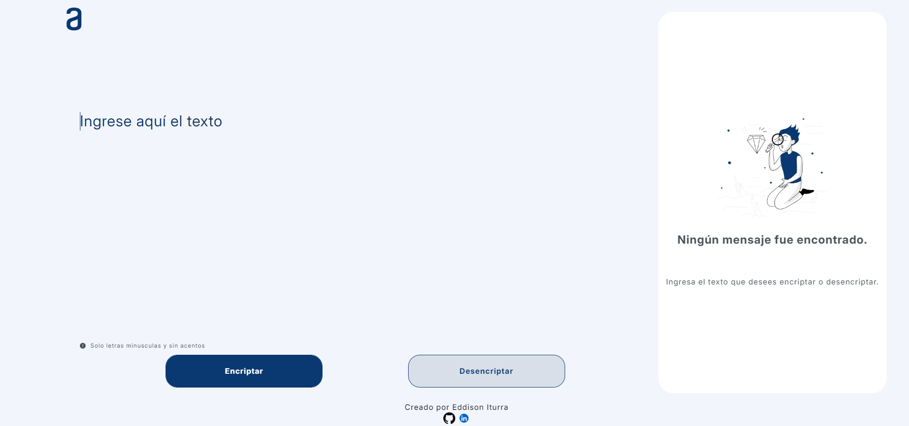

# Encriptador de Texto Online

## Descripción

Este es un encriptador de texto online que te permite cifrar y descifrar mensajes de forma segura y fácil.

## Cómo usar

1. **Visita la web:** Ingresa a eddiebott.github.io/Encriptador/ para acceder al encriptador.
2. **Ingresa el texto que deseas encriptar o desencriptar:** En la sección correspondiente, escribe el texto que deseas encriptar o desencriptar.
3. **Click en Encripar o Desencriptar:** Haz click en el boton encriptar o desencriptar el texto para realizar la accion correspondiente.
4. **Obtén el resultado:** El encriptador mostrará el texto encriptado o desencriptado en la sección de resultados.

## Ejemplo de uso

**Encriptar:**

1. Ingresa el texto: "Hola mundo"
2. Click en Encripar.
3. El encriptador mostrará el texto encriptado: "hoberlai mufatndober"

**Desencriptar:**

1. Ingresa el texto: "hoberlai mufatndober"
2. Click en Desencriptar.
3. El encriptador mostrará el texto desencriptado: "Hola mundo"

## Capturas de pantalla

## Tecnologías utilizadas

HTML, CSS y JavaScript.
